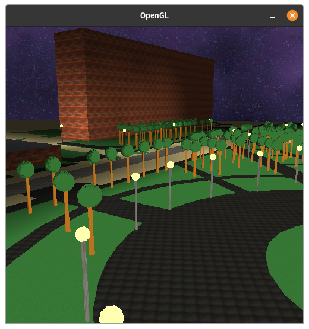
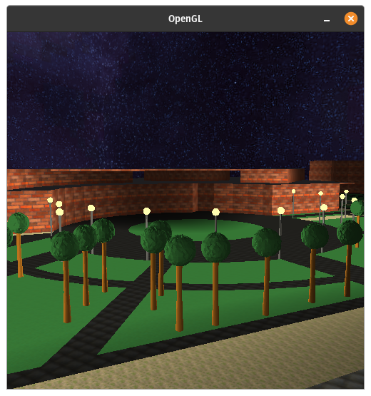

# Computer Graphics and Visualization Project

## Compilation

Target system: Linux (Ubuntu)

1. Install necessary libraries:
   - `glew` (apt: `libglew-dev`)
   - `glm` (apt: `libglm-dev`)
   - `glfw` (apt: `libglfw3-dev`)
   - `gl` (apt: `libgl-dev`)
   - `cgal` (apt: `libcgal-dev`)
2. Compile in the root directory using `$ make`
3. Run with `$ make run`
4. To visualize OSM data you need to import it using documentation from `data/` 

## Project structure

Directories:

- `data/` - input data and preprocessing scripts
- `libs/` - libraries used in project (some are downloaded using `wget` in makefile)
- `models/` - models used in project
- `shaders/` - shaders in GLSL
- `src/` - project source code
- `textures/` - model textures
- `.github/workflows/` - GtiHub Actions specification 

Files:

- `makefile` - makefile for whole project compilation, function descriptions are included in `$ make help`
- `.clang-format` - specification for clang code formatter

# Grafika Komputerowa i Wizualizacja Projekt

## Kompilacja

Docelowy system / Target system: Linux (Ubuntu)

1. Zainstaluj konieczne biblioteki:
   - `glew` (apt: `libglew-dev`)
   - `glm` (apt: `libglm-dev`)
   - `glfw` (apt: `libglfw3-dev`)
   - `gl` (apt: `libgl-dev`)
   - `cgal` (apt: `libcgal-dev`)
2. Kompiluj w głównym katalogu przy pomocy `$ make`
3. Uruchom przy pomocy `$ make run`
4. Do zwizualizowania danych pochodzących z OSM niezbędne jest zaimportowanie ich z wykorzystaniem instrukcji znajdującej się w `data/`

## Struktura projektu

Foldery:

- `data/` - dane wejściowe oraz programy do ich preprocessingu
- `libs/` - biblioteki wykorzystywane w programie (część pobierana `wget` przez makefile)
- `models/` - modele dla projektu
- `shaders/` - shadery w GLSL
- `src/` - źródło programu
- `textures/` - tekstury dla modeli
- `.github/workflows/` - specyfikacja GitHub Actions

Pliki:

- `makefile` - makefile dla kompilacji całego projektu, opis funkcji w `$ make help`
- `.clang-format` - specyfikacja dla formatera kodu
